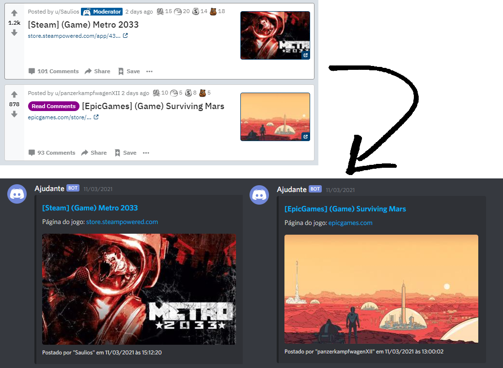

  <h1> r/FreeGameFindings </h1>
  
Application that collects free games published on Reddit and sends them to Discord.

## How does it work

The application runs periodically and is divided into three steps:

1) Authenticates with the [Reddit API](https://github.com/reddit-archive/reddit/wiki/API) and fetches posts from the subreddit [FreeGameFindings](https://www.reddit.com/r/FreeGameFindings/new/).
2) Processes the returned posts and creates the [Discord embeds](https://discord.com/developers/docs/resources/webhook#execute-webhook-jsonform-params).
3) Sends the embeds using the [Discord webhook](https://discord.com/developers/docs/resources/webhook).

## How to install and run:

#### Pre-requisites

- Node.js >= v16 and TypeScript installed.
- A Reddit application to obtain a client ID and a client secret for API usage: [Instructions](https://github.com/reddit-archive/reddit/wiki/OAuth2).
- A Discord webhook: [Instructions](https://support.discord.com/hc/en-us/articles/228383668-Intro-to-Webhooks).

#### Install and run

- Install the dependencies: `npm ci`
- Rename `.env.template` to `.env` and put your credentials:
  - DISCORD_WEBHOOK=Discord webhook URL
  - REDDIT_CLIENT_ID=Reddit client ID
  - REDDIT_CLIENT_SECRET=Reddit client secret
  - REDDIT_USER_AGENT=Application identifier. Follow the [Reddit rules](https://github.com/reddit-archive/reddit/wiki/API#rules). 
- Start the application: `npm run start`

## Disclaimer

This is a repository for personal use, all content collected from Reddit is public and accessed by any user, i just automated this process.

## License

[MIT](LICENSE)