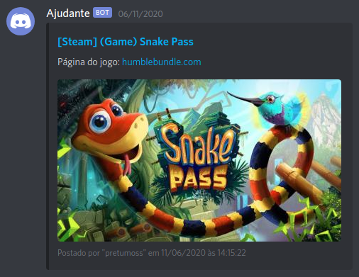

# Reddit scraper - r/FreeGameFindings 

Scraper that collects free games posts published on Reddit and sends them to Discord.

*This project is for personal use. All information collected has their respective links and authors mentioned.

## How does it work?

The bot scrapes [r/FreeGameFindings](https://www.reddit.com/r/FreeGameFindings/) and collects all recent posts. After collecting the posts, the bot removes the invalid posts (not free games or already been sent) and sends the new posts to Discord.

> Example image in portuguese (pt-BR).



## Requirements
- [Node.js](https://nodejs.org/en/) v12.x.x
- [Discord Webhook](https://support.discord.com/hc/pt-br/articles/228383668?page=1#comment_115000025072)

## Run the project

1) Fork and clone the project.
2) Install the dependencies: `npm install`.
3) Create a file called `.env` at the project root and put the variables values:
```
# .env template

WEBHOOK=
INTERVAL=
```
4) Type `node .` to start the application.

5) (optional) You can host on some of these platforms for free: 
- Heroku: https://www.heroku.com/home
- Glitch: https://glitch.com/