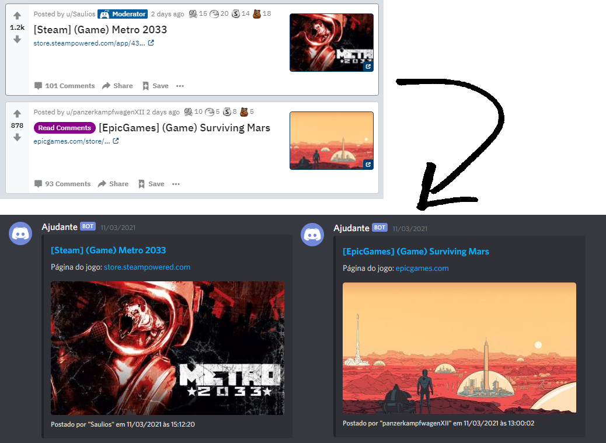
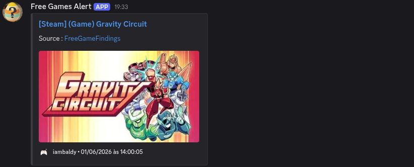
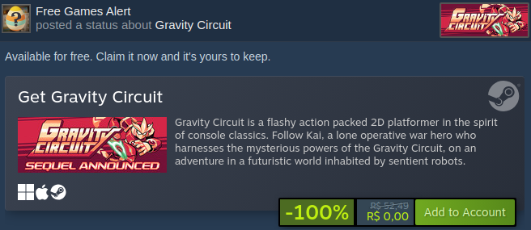

<div align="center">
  <h1>r/FreeGameFindings</h1>
  <p>Application that collects free game posts from <a href="https://www.reddit.com/r/FreeGameFindings/new/">r/FreeGameFindings</a> on Reddit and sends them to a Discord channel and to the Steam activity feed.</p>
</div>



## How it works

The application runs on startup and then every minute via cron, executing the following steps:

1. Fetches the latest posts from the subreddit [r/FreeGameFindings](https://www.reddit.com/r/FreeGameFindings/new/) using one of two data sources:
   - **OAuth API**: Authenticated access via [Reddit API](https://github.com/reddit-archive/reddit/wiki/API) with client credentials. Provides full post data including author avatars and NSFW flags.
   - **RSS Feed**: Public access, no authentication required. Uses the subreddit's [Atom feed](https://www.reddit.com/r/FreeGameFindings/new.rss) to fetch posts without needing API credentials.

2. Sends all posts to a [Discord webhook](https://discord.com/developers/docs/resources/webhook) as [embeds](https://discord.com/developers/docs/resources/webhook#execute-webhook-jsonform-params) containing the post title, link, author, and preview image.



3. Among those posts, filters the ones linking to the [Steam Store](https://store.steampowered.com/) and publishes each one as a status update on the Steam activity feed.



> The application also exposes a health-check HTTP endpoint (`GET /`) for monitoring.

## Pre-requisites

- Node.js >= v24
- A Discord webhook: [How to create](https://support.discord.com/hc/en-us/articles/228383668-Intro-to-Webhooks)
- *(Only for OAuth mode)* A Reddit application for API access: [How to create](https://github.com/reddit-archive/reddit/wiki/OAuth2)
- A Steam account with a public profile

## Setup

1. Install dependencies:

```bash
npm ci
```

2. Copy `.env.template` to `.env` and configure:

```bash
cp .env.template .env
```

| Variable | Required | Description |
|---|---|---|
| `DISCORD_WEBHOOK` | Yes | Discord webhook URL |
| `REDDIT_API_TYPE` | Yes | `RSS` for public access (no credentials needed) or `OAUTH` for authenticated access |
| `REDDIT_CLIENT_ID` | Only for OAUTH | Reddit application client ID |
| `REDDIT_CLIENT_SECRET` | Only for OAUTH | Reddit application client secret |
| `REDDIT_USER_AGENT` | Only for OAUTH | Application identifier. Follow the [Reddit API rules](https://github.com/reddit-archive/reddit/wiki/API#rules) |
| `STEAM_SESSIONID` | Yes | `sessionid` cookie value from an authenticated Steam session |
| `STEAM_LOGIN_SECURE` | Yes | `steamLoginSecure` cookie value from an authenticated Steam session |
| `STEAM_USER_ID` | Yes | Steam profile numeric ID (SteamID64) |

## Running

Development (with hot reload):

```bash
npm run dev
```

Production:

```bash
npm start
```

## Disclaimer

This is a repository for personal use. All content collected from Reddit is public and accessible by any user. This application just automates the process.

## License

[MIT](LICENSE)
