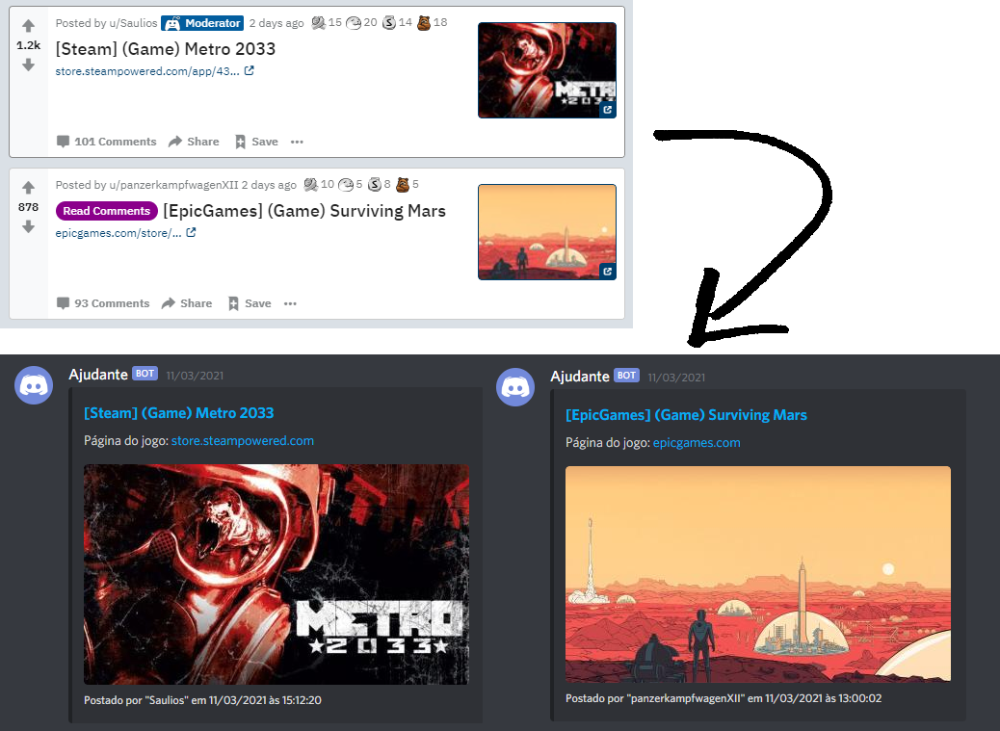

<div style='text-align: center'>
<h3>
<h1> r/FreeGameFindings </h1>
  <a href='./README.md'>English</a> •
  <a href='./README.pt-br.md'>Português (Brasil)</a>
</h3> 
</div>

<hr>

Web scraper que coleta jogos gratuitos publicados no Reddit e os envia para o Discord. Todas as informações coletadas e os respectivos links e autores são mencionados.

## Como funciona?

O bot "raspa" o subreddit [r/FreeGameFindings](https://www.reddit.com/r/FreeGameFindings/) e coleta as publicações recentes. Depois da coleta, o bot remove as que são anúncios, que não possuem origem ou que já foram enviadas. Ao final as publicações são enviadas para o discord através do webhook.



## Instalação:

1) Clone o projeto.
2) Instale as dependências:
```
npm install
```
3) Crie um arquivo chamado `.env` na raiz do projeto e coloque essas variáveis:
```
WEBHOOK= # URL do Webhook do Discord
INTERVAL= # Intervalo em milissegundos
```
4) Digite `node .` para iniciar a aplicação.

5) (opcional) Você pode hospedar em alguma dessas plataformas gratuitamente:
- Heroku: https://www.heroku.com/home
- Glitch: https://glitch.com/